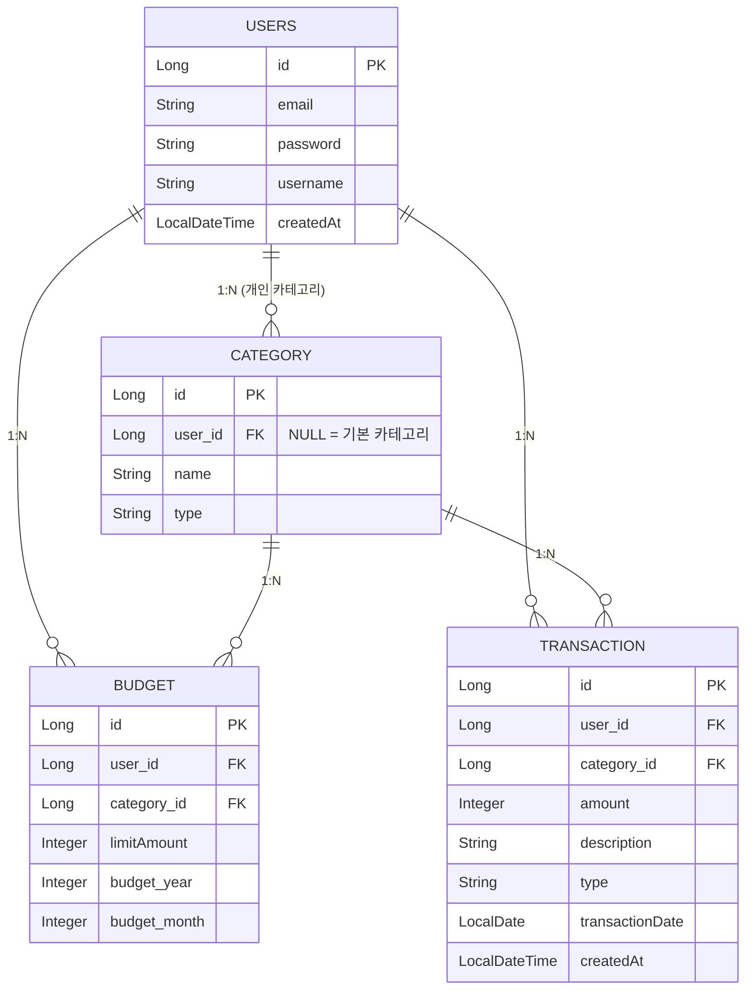

# 💰 Ledgerly — Backend

> **개발 기간:** 2026.03 ~
>
> **한 줄 소개:** JWT 인증 기반의 RESTful 개인 가계부 백엔드 — 예산 통제·리포트·사용자 데이터 격리에 집중한 프로젝트
>
> **🔗 API 서버:** https://ledgerly-kit.duckdns.org
>
> **🔗 라이브 데모:** https://ledgerly-kit.netlify.app
>
> **🔗 프론트엔드 저장소:** https://github.com/kitpractice703/ledgerly-frontend

---

## 1. 프로젝트 소개

**Ledgerly**는 카테고리별 월 예산을 설정하고 수입·지출을 관리하는 가계부 서비스입니다.  
초기에는 Spring MVC + Thymeleaf 구조로 시작하였고, 이후 **React SPA와의 분리 배포를 목표로 REST API 아키텍처로 전면 전환**했습니다.  
기능 구현보다 **JWT 보안 설계**, **사용자 간 데이터 격리(IDOR 방어)**, **통합 테스트** 품질에 집중했습니다.

---

## 2. 기술 스택 (Tech Stack)

| 구분 | 기술 |
|------|------|
| Language | Java 17 |
| Framework | Spring Boot 3.5 |
| Security | Spring Security 6 + JWT (jjwt 0.12.6) |
| Data | Spring Data JPA, Hibernate 6 |
| Validation | Jakarta Bean Validation (`@Valid`, `@NotBlank`) |
| Database | MySQL (운영 — Oracle Cloud), H2 (테스트용 인메모리) |
| Build | Gradle |
| Infra | Docker, Nginx (리버스 프록시) |

---

## 3. 핵심 기능 및 설계 디테일

### ✅ JWT 기반 Stateless 인증

- 로그인 성공 시 서버는 서명된 JWT를 발급하고, 이후 모든 요청은 `Authorization: Bearer <token>` 헤더로 인증합니다.
- `JwtFilter`가 `UsernamePasswordAuthenticationFilter` 앞에 위치하여 토큰을 검증하고 `SecurityContext`에 인증 객체를 주입합니다.
- 세션을 사용하지 않는 `STATELESS` 정책으로 수평 확장에 유리한 구조를 갖습니다.

### ✅ 사용자 데이터 완벽 격리 (IDOR 방어)

- 거래 내역, 예산, 카테고리 모든 조회/수정/삭제 로직에서 `@AuthenticationPrincipal`로 추출한 로그인 사용자와 데이터 소유자 ID를 대조합니다.
- 타인 리소스 접근 시 `IllegalArgumentException`을 던져 400으로 처리하며, DB 조회 자체가 `WHERE user = :user` 조건으로 제한됩니다.

### ✅ 기본 카테고리 + 개인 카테고리 분리 시스템

- `category.user = null`이면 전체 사용자 공유 기본 카테고리, `user = 특정 사용자`이면 개인 카테고리입니다.
- 앱 시작 시 `DataInitializer`가 기본 카테고리(식비·교통비·의료/건강 등 8개)를 자동으로 시딩합니다.
- 기본 카테고리는 거래 내역·예산 연결에 사용할 수 있지만 수정·삭제는 불가합니다.

### ✅ 스마트 예산 관리 시스템

- 카테고리별로 월 예산 한도를 설정하면 해당 월의 실제 지출 합계를 JPQL로 집계하여 **예산 초과 여부(Exceeded)**를 자동으로 계산합니다.
- 예산이 없는 카테고리는 `limitAmount = 0`, `status = NO_BUDGET`으로 표시합니다.

### ✅ 리포트 API

- **월별 트렌드:** 연간 12개월의 수입·지출 합계를 JPQL `GROUP BY MONTH`로 집계하여 반환합니다.
- **카테고리별 분석:** 지정 월의 수입 또는 지출을 카테고리별로 집계합니다 (`type` 파라미터로 전환).
- **연간 요약:** 연간 총수입·총지출·순이익·저축률을 계산하여 단일 DTO로 반환합니다.

### ✅ Fail-Fast 데이터 검증

- DTO에 `@NotBlank`, `@Size`, `@Min`, `@Max` 등을 선언하고 `@Valid` + `BindingResult`로 컨트롤러 진입 전 차단합니다.
- 공백 단독 입력(`" "`)도 `@NotBlank`가 trim 후 검사하여 DB 도달 전에 차단합니다.

---

## 4. 데이터베이스 구조 (ERD)

---

## 5. API 엔드포인트

| Method | URI | 설명 | 인증 |
|--------|-----|------|------|
| POST | `/api/auth/register` | 회원가입 | ✗ |
| POST | `/api/auth/login` | 로그인 (JWT 발급) | ✗ |
| GET | `/api/dashboard` | 월별 대시보드 요약 | ✓ |
| GET/POST | `/api/transactions` | 거래 내역 조회·등록 | ✓ |
| DELETE | `/api/transactions/{id}` | 거래 내역 삭제 | ✓ |
| GET/POST | `/api/budgets` | 예산 조회·등록 | ✓ |
| PUT/DELETE | `/api/budgets/{id}` | 예산 수정·삭제 | ✓ |
| GET/POST/PUT/DELETE | `/api/categories` | 카테고리 관리 | ✓ |
| GET | `/api/reports/monthly-trend` | 월별 수입·지출 트렌드 | ✓ |
| GET | `/api/reports/category-breakdown` | 카테고리별 분석 | ✓ |
| GET | `/api/reports/annual-summary` | 연간 요약 | ✓ |
| GET/PUT | `/api/users/me` | 프로필 조회·수정 | ✓ |
| PUT | `/api/users/me/password` | 비밀번호 변경 | ✓ |

---

## 6. 트러블 슈팅 (Trouble Shooting)

### 🚨 Issue 1: 미인증 요청 시 401 대신 403 반환

- **원인:** `SecurityConfig`에 `AuthenticationEntryPoint`가 설정되지 않아 익명 사용자의 접근 거부가 `AccessDeniedException`(403)으로 처리됨. Spring Security는 `AnonymousAuthenticationToken`이 인증된 상태로 간주되어 권한 부족 → 403으로 분기했습니다.
- **해결:** `.exceptionHandling(ex -> ex.authenticationEntryPoint(new HttpStatusEntryPoint(HttpStatus.UNAUTHORIZED)))`를 추가하여 미인증 요청은 항상 401로 반환하도록 명시 설정.

---

### 🚨 Issue 2: 카테고리 격리 미적용으로 타 사용자 카테고리 접근 가능

- **원인:** 초기 설계에서 `Category`는 사용자 구분 없이 공유 테이블로 운영됨. 거래 내역·예산 등록 시 `categoryId`만 검증하여 타인의 카테고리 ID를 사용할 수 있었습니다.
- **해결:** `Category`에 `user` FK 추가, `CategoryRepository`에 `findByIdAndUser()` 쿼리를 도입. 모든 카테고리 조회·수정·삭제에 `user` 파라미터를 전달하여 소유권 검증.

---

### 🚨 Issue 3: 공백(스페이스바) 입력 시 검증 통과

- **원인:** `@NotEmpty`는 공백 문자(`" "`)를 길이 1인 유효한 값으로 인식.
- **해결:** `@NotBlank`로 교체 — trim 후 빈 값인지 검사하여 공백 단독 입력 차단.

---

### 🚨 Issue 4: 예산·대시보드 API에서 Jackson 직렬화 오류 (`ByteBuddyInterceptor`)

- **원인:** `Budget.category`가 `FetchType.LAZY`로 설정되어 있어, 조회 시 Hibernate가 실제 `Category` 대신 `Category$HibernateProxy` 프록시 객체를 반환합니다. Jackson이 이 프록시의 `hibernateLazyInitializer` 필드를 직렬화하려다 실패하여 500 오류 및 클라이언트 401 루프가 발생했습니다.
- **해결:** `Category` 엔티티에 `@JsonIgnoreProperties({"hibernateLazyInitializer", "handler"})` 추가. Jackson이 Hibernate 프록시 관련 내부 필드를 무시하고 실제 데이터만 직렬화합니다.
